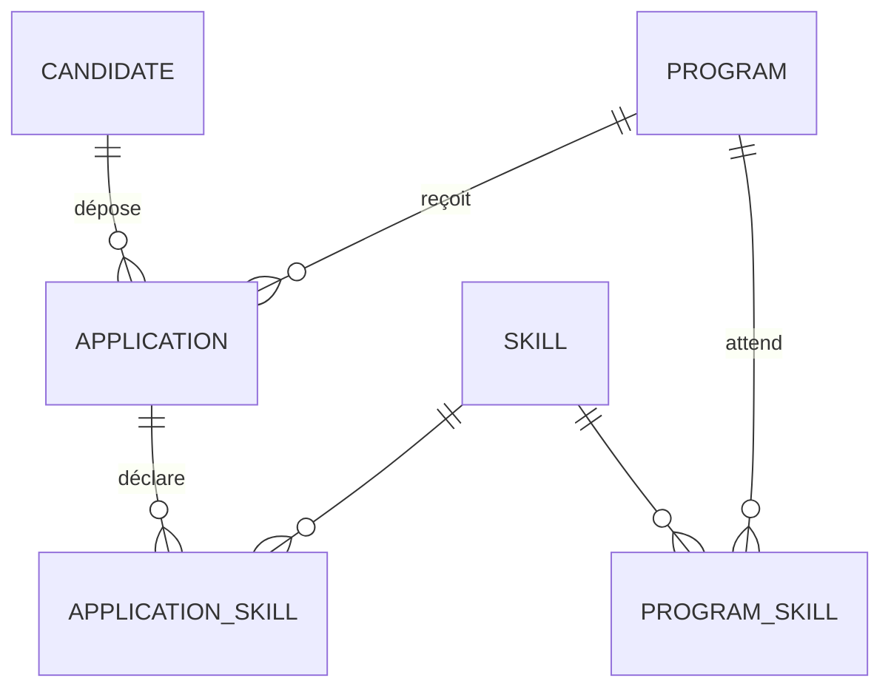

# SKULLVI Talent Engine

Première solution fonctionnelle pour le **Mini-Challenge « Talent Engine »** du programme développeurs SKULLVI (GevConsulting – Human Capital Program).

L'application reçoit des candidatures, collecte les informations essentielles, qualifie les profils, leur attribue un **score explicable** et les classe pour faire ressortir ceux à examiner en priorité.

Réalisé par Ablam DEMAGNA.

## Sommaire

1. [Compréhension du problème](#1-compréhension-du-problème)
2. [Fonctionnalités et état réel](#2-fonctionnalités-et-état-réel)
3. [Stack et architecture](#3-stack-et-architecture)
4. [Modèle de données](#4-modèle-de-données)
5. [Logique de qualification et de scoring](#5-logique-de-qualification-et-de-scoring)
6. [Gestion des erreurs et tests](#6-gestion-des-erreurs-et-tests)
7. [Installation et lancement en local](#7-installation-et-lancement-en-local)
8. [Connexion recruteur](#8-connexion-recruteur)
9. [API en bref](#9-api-en-bref)
10. [Choix de conception](#10-choix-de-conception)
11. [Limites connues et améliorations](#11-limites-connues-et-améliorations)

---

## 1. Compréhension du problème

Le sujet décrit une chaîne en six étapes :

**recevoir → collecter → qualifier → scorer → classer → prioriser**

Je l'ai traduite en deux parcours distincts :

- **Le candidat** (sans compte) choisit un programme ouvert et remplit un seul formulaire : identité, parcours, compétences avec niveau, motivation.
- **Le recruteur** (avec compte) consulte le classement d'un programme, filtre par niveau de priorité, et ouvre le détail d'une candidature pour comprendre son score.

### Hypothèses de départ

- **Plusieurs programmes coexistent.** Une candidature vise un programme précis, et chaque programme définit les compétences qu'il attend.
- **Un candidat n'est pas une candidature.** La même personne peut postuler à plusieurs programmes : son identité est enregistrée une seule fois (l'e-mail est unique).
- **Le score aide, il ne décide pas.** Il sert à trier et à repérer les profils à regarder en premier. Le recruteur garde la décision, d'où un score entièrement explicable : chaque point est justifié dans le détail.
- **Le candidat ne voit jamais son score.** Il reçoit seulement la confirmation que sa candidature est enregistrée.
- **Des règles simples et lisibles plutôt qu'un modèle opaque.** Les poids sont regroupés dans un fichier de configuration, modifiable sans toucher à la logique.

## 2. Fonctionnalités et état réel

| Fonctionnalité | État |
|---|---|
| Liste publique des programmes ouverts | Fait |
| Formulaire de candidature (identité, parcours, compétences et niveaux, motivation) | Fait |
| Validation des données et refus des cas invalides (programme fermé, doublon, données incorrectes) | Fait |
| Scoring automatique, explicable, avec niveau de priorité | Fait |
| Classement des candidatures par programme, avec filtres, recherche, tri et pagination | Fait |
| Détail d'une candidature : profil, compétences, décomposition du score, rang dans le programme | Fait |
| Création de programmes (avec compétences attendues, poids et compétences indispensables) | Fait |
| Référentiel de compétences (création, liste) | Fait |
| Authentification recruteur en deux étapes (mot de passe, puis code à 6 chiffres par e-mail) | Fait |
| Protection des routes recruteur (API et interface) | Fait |
| Tests unitaires du scoring | Fait |
| Changement de statut d'une candidature (nouveau, en revue, présélectionné, refusé, retenu) | Fait côté API <!-- VÉRIFIER : la route PATCH /applications/:id/status existe-t-elle et le front l'utilise-t-il ? Adapter la ligne. --> |
| Envoi d'e-mails aux candidats présélectionnés ou retenus | **Non fait** (prévu) |
| Mode démo pour la connexion sans accès à la boîte e-mail du compte | **Non fait** (prévu) |
| Recalcul des scores après modification des règles | **Non fait** (prévu) |
| Tests automatisés de l'API | **Non fait** (routes testées manuellement avec Postman) |
| Déploiement en ligne | **Non fait** (choix volontaire, voir [section 11](#11-limites-connues-et-améliorations)) |

## 3. Stack et architecture

### Stack

| Partie | Technologies |
|---|---|
| Backend | Node.js, Express, Sequelize, MySQL (`mysql2`) |
| Sécurité | bcrypt (mots de passe et codes), JWT, limitation des tentatives de connexion |
| E-mails | Nodemailer (SMTP) |
| Frontend | React, TypeScript, Vite, React Router, Axios |

### Architecture du backend

Chaque fonctionnalité suit la même chaîne de responsabilités :

| Couche | Rôle |
|---|---|
| Router | associe une URL et une méthode HTTP à un controller, applique les middlewares d'authentification |
| Controller | lit la requête, appelle le service, protège contre les erreurs imprévues |
| Service | logique métier et accès à la base (Sequelize), transactions |
| Modèle | structure des tables, types, contraintes, validations |
| Scoring | fonction pure `calculateScore` (aucun accès à la base ni à Express) et fichier de poids `scoringConfig` |

Toutes les réponses de l'API ont la même enveloppe :

```json
{
  "responseCode": "...",
  "responseMessage": "...",
  "data": [],
  "pagination": { "total": 0, "page": 1, "limit": 20, "totalPages": 0 }
}
```

(`pagination` n'est présent que dans les listes.)


### Architecture du frontend

- `src/data/models` : types TypeScript (`Program`, `Application`, `Candidate`, `Skill`, `User`) qui reflètent les réponses de l'API.
- `src/pages` : un dossier par entité (applications, programs, skills, home, login).
- `src/components` : composants réutilisables (`Button`, `Input`, `Card`, `Alert`, `Navbar`, `ProtectedRoute`…).
- `src/providers` : le routeur et le fournisseur de session (`AuthProvider`).
- Une instance Axios unique envoie le jeton à chaque requête et renvoie vers la connexion si la session expire.

Les variables de couleurs sont centralisées dans `index.css` (palette inspirée du logo SKULLVI) : un changement de teinte se fait en une ligne.

## 4. Modèle de données



| Table | Contenu |
|---|---|
| `candidates` | la personne : nom, e-mail (unique), téléphone, pays, ville, études, liens GitHub et portfolio |
| `programs` | titre (unique), description, statut (`draft`, `open`, `closed`), dates, places, seuils de classement |
| `applications` | le lien candidat ↔ programme : motivation, disponibilité, expérience, projets, statut, **score, niveau de priorité, détail du score (JSON)** |
| `skills` | référentiel des compétences (nom unique, catégorie) |
| `application_skills` | compétences déclarées par candidature, avec le niveau (débutant, intermédiaire, avancé) |
| `program_skills` | compétences attendues par un programme, avec un poids (1 à 5) et un indicateur « indispensable » |
| `users` | comptes recruteurs |
| `otpcodes`, `loginattemps`, `histories` | codes de connexion (hashés), tentatives de connexion échouées, journal d'événements |

Règles garanties par la base elle-même :

- un e-mail de candidat est unique ;
- un candidat ne peut postuler qu'**une fois** par programme (index unique sur `candidateId` + `programId`) ;
- une compétence n'apparaît qu'une fois par candidature et une fois par programme ;
- supprimer un candidat supprime ses candidatures, mais un programme qui a reçu des candidatures ne peut pas être supprimé.

## 5. Logique de qualification et de scoring

Le score vaut **100 points au maximum**. Les poids sont définis dans `scoringConfig.js`.

| Critère | Max | Calcul |
|---|---|---|
| Compétences | 35 | Pour chaque compétence attendue par le programme : poids (1 à 5) × facteur du niveau déclaré (débutant 0,4 · intermédiaire 0,7 · avancé 1), rapporté à la somme des poids |
| Expérience et projets | 20 | 10 points selon les années d'expérience (plafond : 5 ans) + 10 points selon le nombre de projets (plafond : 5) |
| Liens | 15 | GitHub : 10 · portfolio : 5 |
| Disponibilité | 15 | Temps plein : 15 · temps partiel : 9 · week-ends : 5 |
| Motivation | 15 | 8 points selon la longueur du texte (de 30 à 300 caractères) + 7 points selon la présence de mots-clés pertinents (3 mots-clés = maximum ; insensible à la casse et aux accents) |

Le total est arrondi à l'entier.

### Niveau de priorité

| Niveau | Condition |
|---|---|
| `priority` (à examiner en priorité) | score ≥ seuil « prioritaire » du programme (70 par défaut) |
| `to_review` (à examiner) | score ≥ seuil « à examiner » du programme (40 par défaut) |
| `low` (faible) | en dessous |

Les seuils sont **propres à chaque programme** : un programme plus sélectif peut être plus exigeant.

### Règle des compétences indispensables

Si le programme a marqué une compétence comme **indispensable** et que le candidat ne l'a pas déclarée, il ne peut pas être classé `priority` : il est plafonné à `to_review`, même avec un bon score par ailleurs. Cette situation est signalée dans le détail du score (`cappedByRequiredSkills`).

Si un programme n'a défini aucune compétence attendue, le critère « compétences » note simplement le nombre de compétences déclarées (plafond : 5).

### Un score explicable

Pour chaque candidature, le détail est enregistré (`scoreBreakdown`) : points par critère, compétences trouvées, compétences indispensables manquantes. La page de détail l'affiche, avec le rang du candidat dans le programme.

### Exemple chiffré

Programme attendant React (poids 5, indispensable), Node.js (5, indispensable), Express (3), MySQL (3) et Git (2). Candidat : React avancé, Node.js intermédiaire, Git intermédiaire ; 2 ans d'expérience, 4 projets ; GitHub renseigné, pas de portfolio ; temps plein ; motivation de 115 caractères contenant 3 mots-clés.

| Critère | Calcul | Points |
|---|---|---|
| Compétences | (5×1 + 5×0,7 + 2×0,7) / 18 × 35 | 19,25 |
| Expérience et projets | 2/5×10 + 4/5×10 | 12 |
| Liens | GitHub seul | 10 |
| Disponibilité | temps plein | 15 |
| Motivation | (115−30)/270×8 + 7 | 9,52 |
| **Total** | | **66 (à examiner)** |

Les deux compétences indispensables sont présentes : il n'y a pas de plafonnement ici.


### Limites assumées du scoring

- La motivation est évaluée par une **heuristique simple** (longueur et mots-clés). Elle est facile à contourner et ne juge pas la qualité du fond.
- Les compétences sont **déclarées**, pas vérifiées.
- Le score sert à **trier**, jamais à décider à la place du recruteur.

## 6. Gestion des erreurs et tests

### Erreurs anticipées

- **Validation des entrées** : champs obligatoires, formats (e-mail, URL, dates), valeurs autorisées (énumérations), bornes numériques. Les erreurs renvoient un code 400 avec le détail du champ fautif.
- **Règles métier** : programme introuvable (404), programme fermé ou date limite dépassée (400), candidature déjà déposée (409), compétence inexistante (400).
- **Cohérence** : création du candidat, de la candidature, des compétences et du score dans **une transaction** : en cas d'échec, rien n'est enregistré à moitié.
- **Concurrence** : si deux requêtes identiques arrivent en même temps, la contrainte d'unicité de la base est interceptée et renvoyée en 409.
- **Données de confiance** : seuls les champs prévus sont lus dans la requête. Un candidat ne peut pas envoyer lui-même un score, un statut ou un niveau de priorité.
- **Authentification** : mots de passe et codes de connexion hashés (bcrypt) ; code à usage unique, durée limitée et nombre d'essais limité ; blocage temporaire après plusieurs échecs de connexion ; message d'erreur identique que le compte existe ou non.

### Tests

Les règles de scoring sont isolées dans une fonction pure, testée avec Jest :

```bash
npm test
```

Cas couverts : profil parfait (100 points), profil vide, compétence indispensable manquante (plafonnement), influence du niveau de maîtrise, calcul pondéré partiel, programme sans compétences attendues, longueur de la motivation, mots-clés avec majuscules et accents, disponibilité inconnue, bornes des seuils de priorité.
Les routes de l'API ont été testées manuellement avec Postman. Il n'existe pas encore de tests automatisés d'API.

## 7. Installation et lancement en local


### Prérequis

- Node.js 18 ou supérieur (testé avec Node.js 24)
- MySQL 8
- Un compte Gmail avec la validation en deux étapes (pour recevoir le code de connexion), ou tout autre serveur SMTP

### Backend

```bash
cd backend
npm install
```

1. Créez la base de données :

   ```sql
   CREATE DATABASE skl_db CHARACTER SET utf8mb4 COLLATE utf8mb4_unicode_ci;
   ```

2. Copiez le fichier d'exemple et remplissez-le :

   ```bash
   cp .env.example .env        # Windows : copy .env.example .env
   ```

   Variables à renseigner : accès MySQL, quatre secrets JWT (la commande pour les générer est dans le fichier), configuration SMTP, et l'e-mail et le mot de passe du compte recruteur.

3. Lancez le serveur. Les tables sont créées au démarrage (`sequelize.sync()`, sans suppression de données existantes) :

   ```bash
   npm run dev
   ```

   

4. Chargez les données de départ (dans un autre terminal) :

   ```bash
   npm run seed:skills     # 16 compétences de départ
   npm run seed:admin      # compte recruteur défini dans le .env
   ```

Le serveur écoute sur `http://localhost:5001`.

### Frontend

```bash
cd frontend
npm install
cp .env.example .env        # VITE_API_URL=http://localhost:5001
npm run dev
```

L'application est disponible sur `http://localhost:5173` (adresse autorisée par le CORS du backend).

### Premier parcours de test

1. Connectez-vous en recruteur (voir section suivante).
2. Créez un programme avec « Nouveau programme » : statut **ouvert**, quelques compétences attendues, dont une indispensable.
3. Déconnectez-vous, puis déposez une candidature depuis la liste des programmes (« Postuler »).
4. Reconnectez-vous : la candidature apparaît dans le classement, avec son score. Ouvrez-la pour voir la décomposition.
5. Testez les cas d'erreur : déposer deux fois la même candidature (refusée), postuler sans la compétence indispensable (plafonnée à « à examiner »).

## 8. Connexion recruteur

La connexion se fait en deux étapes :

1. **Mot de passe** : vérifié côté serveur, puis un **code à 6 chiffres** est envoyé par e-mail à l'adresse du compte.
2. **Code** : saisi dans la page de connexion, il donne accès aux jetons de session. Il est à usage unique et expire rapidement.

Le compte recruteur est créé par `npm run seed:admin` à partir des variables `ADMIN_EMAIL` et `ADMIN_PASSWORD`. **Le code est envoyé à `ADMIN_EMAIL`** : utilisez donc une adresse dont vous contrôlez la boîte de réception.

### Configurer l'envoi du code avec Gmail

1. Activez la validation en deux étapes sur le compte Google.
2. Créez un « mot de passe d'application » dans les paramètres de sécurité du compte.
3. Renseignez dans le `.env` : `MAIL_USER` (l'adresse Gmail), `MAIL_PASSWORD` (le mot de passe d'application à 16 caractères, pas le mot de passe du compte) et `MAIL_FROM` au format `"SKULLVI Talent Engine <adresse@gmail.com>"`.


## 9. API en bref

Les chemins ci-dessous sont relatifs à l'adresse du serveur. Les routes recruteur exigent l'en-tête `Authorization: Bearer <jeton>`.


### Routes publiques

| Méthode | Chemin | Rôle |
|---|---|---|
| `GET` | `/programs` | programmes ouverts (le recruteur connecté voit aussi les brouillons et les programmes fermés) |
| `GET` | `/skills` | référentiel des compétences (filtres `category`, `search`) |
| `POST` | `/applications` | dépôt d'une candidature |
| `POST` | `/authentication/signin` | étape 1 de la connexion |
| `POST` | `/authentication/verify-otp` | étape 2 de la connexion |

### Routes recruteur

| Méthode | Chemin | Rôle |
|---|---|---|
| `GET` | `/applications` | classement et filtres : `programId`, `status`, `priorityLevel`, `minScore`, `search`, `sortBy`, `order`, `page`, `limit` |
| `GET` | `/applications/:id` | détail, décomposition du score, rang |
| `PATCH` | `/applications/:id/status` | changement de statut |
| `GET` | `/candidates` | liste des candidats (recherche, filtres, meilleur score) |
| `POST` | `/programs` | création d'un programme avec ses compétences attendues |
| `POST` | `/skills/create` | ajout d'une compétence au référentiel |

Exemple de candidature :

```json
POST /applications
{
  "programId": 1,
  "candidate": {
    "firstName": "Prénom",
    "lastName": "Nom",
    "email": "exemple@mail.com",
    "educationLevel": "licence",
    "githubUrl": "https://github.com/exemple"
  },
  "motivation": "Texte d'au moins 30 caractères…",
  "availability": "full_time",
  "yearsOfExperience": 2,
  "projectsCount": 4,
  "skills": [
    { "skillId": 4, "level": "advanced" },
    { "skillId": 7, "level": "intermediate" }
  ]
}
```

## 10. Choix de conception

- **Candidat et candidature séparés** : évite les doublons d'identité et permet de postuler à plusieurs programmes.
- **Référentiel de compétences** : le candidat choisit dans une liste fermée, sans saisie libre. Les écritures différentes d'une même compétence (« reactjs », « React JS ») ne faussent donc pas le scoring.
- **Compétences attendues par programme** : le score mesure l'écart avec ce que **ce** programme demande, pas un profil générique.
- **Scoring en fonction pure** : aucune dépendance à la base ou au serveur, donc simple à tester et à expliquer.
- **Poids en configuration, seuils en base** : les poids du scoring se changent dans un fichier ; les seuils de priorité sont propres à chaque programme.
- **Détail du score enregistré en JSON** : un seul champ suffit pour expliquer le score. Une vraie table ne serait utile que pour filtrer ou agréger par critère.
- **Une seule route de liste** pour le classement et les profils prioritaires : le classement est un tri par score, la priorité est un filtre.
- **Aucun déploiement** : choix volontaire pour garder une solution simple, reproductible et maîtrisée.

## 11. Limites connues et améliorations

### Limites connues

- **Motivation** évaluée de façon rudimentaire (voir section 5).
- **Compétences non vérifiées** : le score repose sur ce que le candidat déclare.
- **E-mail du candidat non vérifié** : quelqu'un qui connaît l'adresse d'un candidat peut déposer une candidature à son nom, et les informations d'identité de ce candidat sont alors mises à jour.
- **Pas de recalcul automatique** des scores quand les règles ou les poids changent.
- **Pas de tests automatisés de l'API** (uniquement le scoring).
- **Jeton d'accès de courte durée**, sans renouvellement automatique côté interface : après expiration, l'utilisateur est renvoyé vers la connexion.
- **Non déployé** : l'offre gratuite de l'hébergeur envisagé (Render) bloque l'envoi d'e-mails par SMTP, endort le serveur après 15 minutes d'inactivité et limite la durée de vie de la base de données. Le projet est donc conçu pour se lancer en local en quelques commandes.

### Améliorations prévues

1. E-mails aux candidats présélectionnés ou retenus, avec un bouton dans la page de détail.
2. Mode démo pour la connexion.
3. Service de recalcul des scores.
4. Vérification de l'adresse e-mail du candidat.
5. Tests d'API automatisés et intégration continue.
6. Évaluation de la motivation plus fine (par exemple analyse de contenu assistée), tout en gardant un score explicable.
7. Limitation globale du débit des requêtes sur les routes publiques.